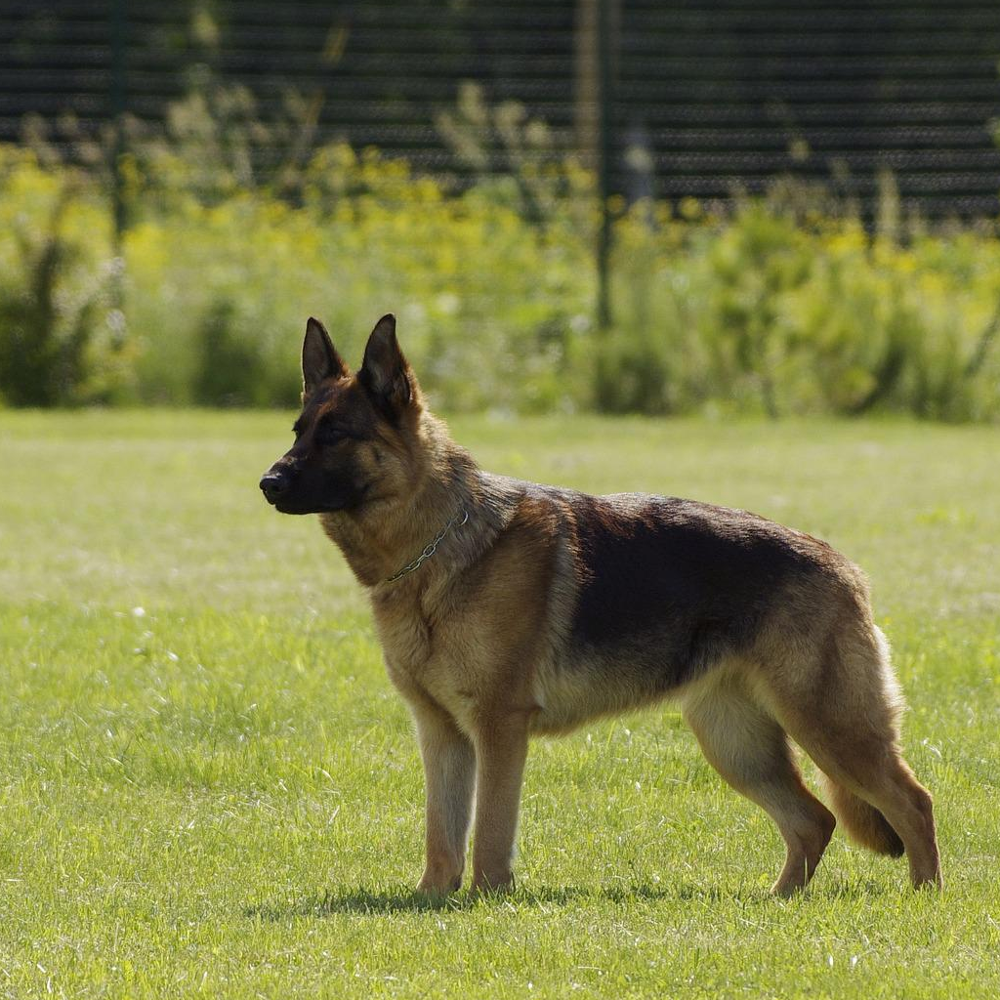

# Imagic: Text-Based Real Image Editing with Diffusion Models

This repository contains an unofficial implementation of Google's paper **Imagic: Text-Based Real Image Editing with Diffusion Models**. 
The goal of this project is to edits a single real-world image using a target text prompt.

Key distinctions from the papers include:

- Employing LoRA to accommodate the fine-tuning stage within a 24GB VRAM environment.
- Adjusting the learning rate for the fine-tuning stage from 5e-7 to 1e-4, aligning with the default configuration of LoRA.

## Results

| original image | 30 iters, 6/9 | 90 iters, 7/9 |
|---|---|---|
|  |  | 


## References

This implementation was inspired by and references the following repositories:

- [dreamgaussian/dreamgaussian](https://github.com/dreamgaussian/dreamgaussian)


## Installation

1. Clone the repository:

```shell
git clone --recurse-submodules https://github.com/sangminkim-99/Imagic.git
cd Imagic
```

2. Create and activate a new Conda environment:

```shell
conda create -n imagic python=3.9
conda activate imagic
```

3. Install the necessary dependencies:

```shell
conda install pytorch torchvision torchaudio pytorch-cuda=11.8 -c pytorch -c nvidia # change to your own version of torch
pip install -r requirements.txt
```

## Usage

```shell
python main.py --image_path data/dog2.png --prompt "A photo of a sitting dog" --savedir result/sitting_dog
```

## TODOs

- [ ] Reproduce the thumbs up example


## Acknowledgments

We would like to express our gratitude to the authors of the original paper and the developers of the referenced repositories for their valuable contributions, which served as the foundation for this implementation.


## Disclaimer

This is an unofficial implementation and is not affiliated with Google or the authors of the original paper.
